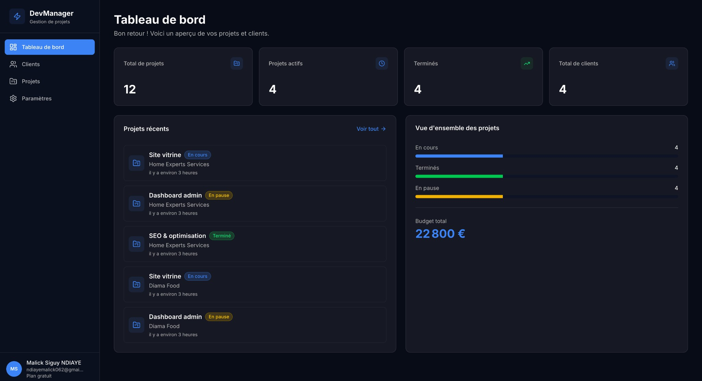
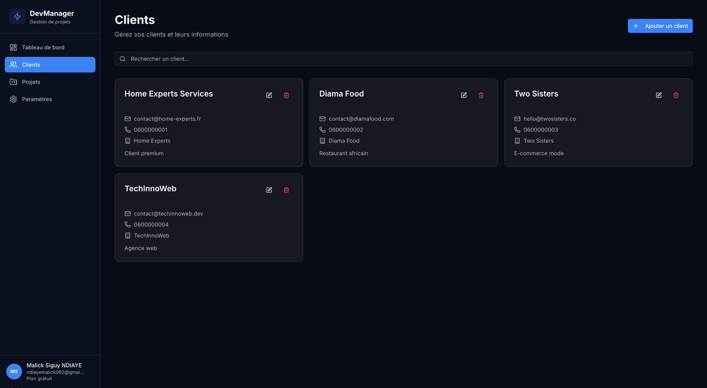
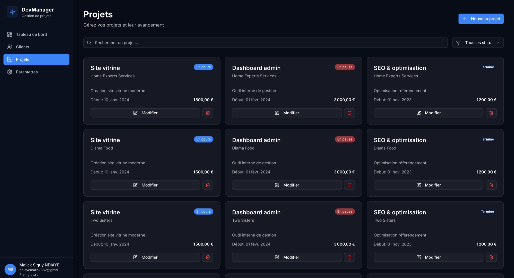
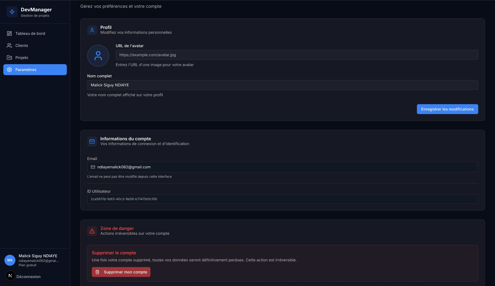

# 🚀 DevManager

**Application web moderne de gestion de projets et clients pour développeurs freelance**

DevManager est une application complète et moderne qui permet aux développeurs freelance de gérer efficacement leurs clients, projets, budgets et tâches. Construite avec Next.js 16, TypeScript, et Supabase, elle offre une expérience utilisateur fluide avec un design moderne et des fonctionnalités professionnelles.


## 📸 Aperçu de l'application

### Tableau de bord

*Vue d'ensemble avec statistiques, projets récents et budget total*

### Gestion des clients

*Interface de gestion complète des clients avec recherche et actions rapides*

### Gestion des projets

*Vue en grille des projets avec filtres par statut et recherche*

### Paramètres

*Gestion du profil, informations du compte et zone de danger*

## ✨ Fonctionnalités principales

### 🔐 Authentification complète
- ✅ **Inscription/Connexion** avec email et mot de passe
- ✅ **Connexion Google OAuth** (un clic pour se connecter)
- ✅ **Vérification d'email** avec page dédiée
- ✅ **Gestion de session** automatique
- ✅ **Routes protégées** avec middleware Next.js
- ✅ **Protection côté client et serveur** (défense en profondeur)

### 📊 Dashboard


- 📈 **Statistiques en temps réel** :
  - Nombre total de clients
  - Projets actifs et terminés
  - Budget total de tous les projets
- 📋 **Liste des projets récents** avec aperçu rapide
- 🎨 **Interface moderne** avec cartes glassmorphism
- 📊 **Vue d'ensemble des projets** avec barres de progression par statut

### 👥 Gestion des clients


- ➕ **CRUD complet** (Créer, Lire, Modifier, Supprimer)
- 🔍 **Recherche en temps réel** par nom, email, entreprise
- 📝 **Informations complètes** :
  - Nom complet
  - Email et téléphone
  - Entreprise
  - Adresse
  - Notes personnalisées
- 🗑️ **Suppression avec confirmation** (AlertDialog)
- 📄 **Pagination** pour grandes listes
- 🎨 **Cartes visuelles** avec icônes pour chaque type d'information

### 📁 Gestion des projets


- ➕ **CRUD complet** avec validation
- 🏷️ **Filtres par statut** :
  - En cours (`in_progress`)
  - Terminé (`completed`)
  - En pause (`paused`)
- 🔗 **Liaison avec clients** (sélection dans dropdown)
- 💰 **Gestion des budgets** et dates (début/fin)
- 🎨 **Badges de statut colorés**
- 🔍 **Recherche** par nom ou description
- 📄 **Pagination** intégrée
- 📅 **Affichage des dates** formatées en français

### ⚙️ Paramètres et profil


- 👤 **Modification du profil** :
  - Nom complet
  - Avatar (URL d'image)
  - Aperçu en temps réel
- 📧 **Informations du compte** (email, ID utilisateur)
- 🗑️ **Suppression de compte** avec confirmation sécurisée
- ⚠️ **Zone de danger** clairement identifiée
- 🔒 **Sécurité renforcée** avec double confirmation

### 🎨 Design moderne
- 🌙 **Thème sombre "Bold & Modern"** inspiré Vercel/GitHub
- ✨ **Glassmorphism** sur les cartes
- 🎭 **Animations fluides** et transitions
- 📱 **Responsive design** (mobile, tablette, desktop)
- 🎯 **UX optimisée** avec loaders et notifications

## 🛠️ Stack Technique

### Frontend
- **Next.js 16** - Framework React avec App Router
- **TypeScript** - Typage statique
- **Tailwind CSS 4** - Framework CSS utility-first
- **shadcn/ui** - Composants UI accessibles et personnalisables
- **Lucide React** - Bibliothèque d'icônes moderne
- **React Hook Form** - Gestion de formulaires performante
- **Zod** - Validation de schémas TypeScript-first
- **date-fns** - Manipulation de dates

### Backend & State Management
- **Supabase** - Backend-as-a-Service
  - Authentication (Auth)
  - PostgreSQL Database
  - Row Level Security (RLS)
- **TanStack React Query** - Gestion d'état serveur
  - Cache intelligent
  - Optimistic updates
  - Refetch automatique
- **Sonner** - Notifications toast modernes

### Architecture
- **App Router** (Next.js 16) - Routing moderne
- **Server Components** - Rendu côté serveur
- **Client Components** - Interactivité côté client
- **Route Groups** - Organisation des routes
- **Middleware** - Protection des routes
- **Error Boundaries** - Gestion d'erreurs
- **Loading States** - États de chargement

## 📋 Prérequis

- **Node.js** 18+ 
- **npm** ou **yarn** ou **pnpm**
- Un compte **Supabase** (gratuit) - [supabase.com](https://supabase.com)
- (Optionnel) Un compte **Google Cloud** pour OAuth - [console.cloud.google.com](https://console.cloud.google.com)

## 🚀 Installation

### 1. Cloner et installer les dépendances

```bash
# Cloner le repository (si applicable)
git clone <votre-repo>
cd devmanager

# Installer les dépendances
npm install
```

### 2. Configurer les variables d'environnement

Créez un fichier `.env.local` à la racine du projet :

```env
# Supabase (requis)
NEXT_PUBLIC_SUPABASE_URL=votre_url_supabase
NEXT_PUBLIC_SUPABASE_ANON_KEY=votre_cle_anon

# Supabase Admin (optionnel, pour la suppression de compte)
SUPABASE_SERVICE_ROLE_KEY=votre_service_role_key
```

> 💡 **Où trouver ces valeurs ?**
> - Allez sur [supabase.com](https://supabase.com)
> - Sélectionnez votre projet
> - Allez dans **Settings** → **API**
> - Copiez l'URL et les clés

### 3. Configurer Supabase

Suivez les instructions détaillées dans [`SUPABASE_SETUP.md`](./SUPABASE_SETUP.md) pour :

1. Créer les tables (`profiles`, `clients`, `projects`, `user_roles`)
2. Configurer les politiques RLS (Row Level Security)
3. Créer le trigger pour la création automatique de profil

### 4. (Optionnel) Configurer Google OAuth

Pour activer la connexion avec Google :

1. Suivez les instructions dans [`GOOGLE_OAUTH_SETUP.md`](./GOOGLE_OAUTH_SETUP.md)
2. Configurez Google Cloud Console
3. Activez le provider dans Supabase

### 5. Lancer le serveur de développement

```bash
npm run dev
```

Ouvrez [http://localhost:3000](http://localhost:3000) dans votre navigateur.

## 📁 Structure du projet

```
devmanager/
├── app/                          # Pages Next.js (App Router)
│   ├── (dashboard)/             # Route group pour le dashboard
│   │   ├── dashboard/           # Page principale
│   │   ├── clients/             # Gestion des clients
│   │   ├── projects/            # Gestion des projets
│   │   ├── settings/            # Paramètres utilisateur
│   │   ├── layout.tsx           # Layout avec Sidebar
│   │   ├── loading.tsx          # Loading state
│   │   └── error.tsx            # Error boundary
│   ├── api/                     # Routes API Next.js
│   │   ├── auth/
│   │   │   └── callback/        # Callback OAuth
│   │   └── account/
│   │       └── delete/          # Suppression de compte
│   ├── login/                   # Page de connexion
│   ├── register/                # Page d'inscription
│   ├── verify-email/           # Vérification d'email
│   ├── page.tsx                 # Landing page
│   ├── layout.tsx               # Layout racine
│   ├── providers.tsx            # Providers (Query, Auth, Toaster)
│   └── globals.css              # Styles globaux
├── components/
│   ├── auth/
│   │   ├── google-button.tsx    # Bouton Google OAuth
│   │   └── ProtectedRoute.tsx   # Protection côté client
│   ├── forms/
│   │   ├── client-form.tsx      # Formulaire client
│   │   ├── login-form.tsx       # Formulaire connexion
│   │   ├── profile-form.tsx     # Formulaire profil
│   │   ├── project-form.tsx     # Formulaire projet
│   │   └── register-form.tsx    # Formulaire inscription
│   ├── layout/
│   │   └── Sidebar.tsx          # Navigation latérale
│   └── ui/                      # Composants shadcn/ui
│       ├── alert-dialog.tsx
│       ├── badge.tsx
│       ├── button.tsx
│       ├── card.tsx
│       ├── dialog.tsx
│       ├── form.tsx
│       ├── input.tsx
│       ├── loading.tsx
│       ├── pagination.tsx
│       ├── separator.tsx
│       ├── skeleton.tsx
│       ├── textarea.tsx
│       └── toaster.tsx
├── contexts/
│   └── AuthContext.tsx          # Contexte d'authentification
├── hooks/
│   ├── useClients.ts            # Hooks pour clients
│   ├── usePagination.ts         # Hook de pagination
│   ├── useProfile.ts            # Hooks pour profil
│   └── useProjects.ts           # Hooks pour projets
├── lib/
│   ├── env.ts                   # Validation des variables d'environnement
│   ├── supabase/
│   │   ├── admin.ts             # Client Supabase Admin
│   │   ├── client.ts            # Client Supabase (browser)
│   │   └── server.ts            # Client Supabase (server)
│   ├── utils.ts                 # Utilitaires (cn, etc.)
│   └── validations.ts           # Schémas Zod
├── middleware.ts                # Middleware Next.js (protection routes)
├── SUPABASE_SETUP.md            # Documentation Supabase
├── GOOGLE_OAUTH_SETUP.md        # Documentation Google OAuth
├── EMAIL_VERIFICATION.md         # Documentation vérification email
└── README.md                    # Ce fichier
```

## 🎯 Guide d'utilisation

### Première connexion

1. **Créer un compte** :
   - Allez sur `/register`
   - Remplissez le formulaire ou utilisez Google OAuth
   - Vérifiez votre email (si requis)

2. **Se connecter** :
   - Allez sur `/login`
   - Utilisez vos identifiants ou Google OAuth

3. **Accéder au dashboard** :
   - Après connexion, vous êtes redirigé vers `/dashboard`
   - Consultez vos statistiques et projets récents

### Gérer vos clients

1. Allez dans **Clients** (menu latéral)
2. Cliquez sur **Ajouter un client**
3. Remplissez les informations (nom requis, autres optionnels)
4. Utilisez la recherche pour trouver rapidement un client
5. Cliquez sur **Modifier** ou **Supprimer** pour gérer vos clients

### Gérer vos projets

1. Allez dans **Projets** (menu latéral)
2. Cliquez sur **Ajouter un projet**
3. Sélectionnez un client, définissez le statut, budget, dates
4. Utilisez les filtres pour voir les projets par statut
5. Utilisez la recherche pour trouver un projet

### Modifier votre profil

1. Allez dans **Paramètres** (menu latéral)
2. Modifiez votre nom complet et/ou avatar
3. Cliquez sur **Enregistrer les modifications**

### Supprimer votre compte

1. Allez dans **Paramètres** → **Zone de danger**
2. Cliquez sur **Supprimer mon compte**
3. Confirmez la suppression (⚠️ **irréversible**)

## 🔒 Sécurité

### Protection des données

- ✅ **Row Level Security (RLS)** activé sur toutes les tables Supabase
- ✅ Chaque utilisateur ne peut accéder qu'à ses propres données
- ✅ Validation côté client et serveur
- ✅ Protection CSRF avec Supabase

### Authentification

- ✅ **Middleware Next.js** pour la protection des routes
- ✅ **ProtectedRoute** pour la protection côté client
- ✅ **Vérification d'email** pour les nouveaux comptes
- ✅ **Sessions sécurisées** avec Supabase Auth

### Suppression de compte

- ✅ Route API sécurisée avec service_role key
- ✅ Confirmation en double (dialog + action)
- ✅ Suppression en cascade automatique (profil, clients, projets)

## 🚢 Déploiement

### Vercel (recommandé)

1. **Connecter votre repository** :
   - Allez sur [vercel.com](https://vercel.com)
   - Importez votre projet GitHub/GitLab

2. **Configurer les variables d'environnement** :
   - `NEXT_PUBLIC_SUPABASE_URL`
   - `NEXT_PUBLIC_SUPABASE_ANON_KEY`
   - `SUPABASE_SERVICE_ROLE_KEY` (optionnel)

3. **Déployer** :
   - Vercel détecte automatiquement Next.js
   - Le build se lance automatiquement

4. **Mettre à jour les URLs Supabase** :
   - Dans Supabase Dashboard → **Authentication** → **URL Configuration**
   - Ajoutez votre URL de production dans **Redirect URLs**

### Autres plateformes

Le projet peut être déployé sur n'importe quelle plateforme supportant Next.js :
- **Netlify**
- **Railway**
- **Render**
- **AWS Amplify**
- etc.

## 📚 Documentation supplémentaire

- [`SUPABASE_SETUP.md`](./SUPABASE_SETUP.md) - Configuration complète de Supabase
- [`GOOGLE_OAUTH_SETUP.md`](./GOOGLE_OAUTH_SETUP.md) - Configuration Google OAuth
- [`EMAIL_VERIFICATION.md`](./EMAIL_VERIFICATION.md) - Configuration vérification email
- [`SUPABASE_DELETE_ACCOUNT.md`](./SUPABASE_DELETE_ACCOUNT.md) - Configuration suppression de compte

## 🛠️ Scripts disponibles

```bash
# Développement
npm run dev          # Lance le serveur de développement

# Production
npm run build        # Build de production
npm run start        # Lance le serveur de production

# Qualité de code
npm run lint         # Vérifie le code avec ESLint
```

## 🎨 Design System

### Couleurs

- **Background principal** : `hsl(222, 47%, 6%)`
- **Accent primaire** : `hsl(217, 91%, 60%)` (bleu électrique)
- **Cards glassmorphism** : `bg-white/5`, `backdrop-blur-xl`, `border-white/10`

### Typographie

- **Police principale** : Inter (système)
- **Tailles** : Responsive avec Tailwind CSS

### Composants

- Utilisation de **shadcn/ui** pour les composants de base
- **Glassmorphism** pour les cartes
- **Animations fluides** avec Tailwind CSS

## 🐛 Dépannage

### Erreur de connexion Supabase

- Vérifiez que les variables d'environnement sont correctes
- Vérifiez que votre projet Supabase est actif
- Consultez la console du navigateur pour les erreurs

### Erreur OAuth Google

- Vérifiez la configuration dans Google Cloud Console
- Vérifiez que l'URL de redirection est correcte dans Supabase
- Consultez [`GOOGLE_OAUTH_SETUP.md`](./GOOGLE_OAUTH_SETUP.md)

### Erreur de vérification d'email

- Vérifiez que la vérification d'email est activée dans Supabase
- Vérifiez les Redirect URLs dans Supabase
- Consultez [`EMAIL_VERIFICATION.md`](./EMAIL_VERIFICATION.md)

## 🤝 Contribution

Les contributions sont les bienvenues ! N'hésitez pas à :

1. Fork le projet
2. Créer une branche pour votre fonctionnalité (`git checkout -b feature/AmazingFeature`)
3. Commit vos changements (`git commit -m 'Add some AmazingFeature'`)
4. Push vers la branche (`git push origin feature/AmazingFeature`)
5. Ouvrir une Pull Request

## 📝 License

Ce projet est sous licence MIT. Voir le fichier `LICENSE` pour plus de détails.

## 🙏 Remerciements

- [Next.js](https://nextjs.org/) - Framework React
- [Supabase](https://supabase.com/) - Backend-as-a-Service
- [shadcn/ui](https://ui.shadcn.com/) - Composants UI
- [Tailwind CSS](https://tailwindcss.com/) - Framework CSS
- [TanStack Query](https://tanstack.com/query) - State management

## 📞 Support

Pour toute question ou problème :

1. Consultez la documentation dans les fichiers `.md`
2. Vérifiez les issues existantes
3. Créez une nouvelle issue si nécessaire

---

**Fait avec ❤️ pour les développeurs freelance**
